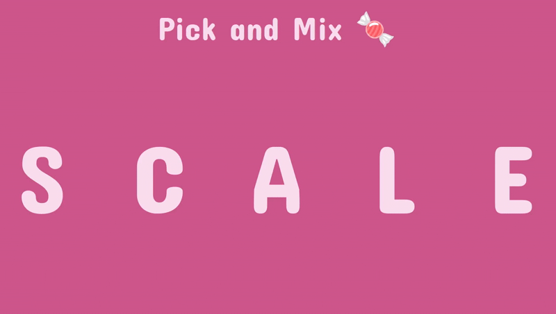

# Pick And Mix: A Semantic Word Puzzle

## Live Demo

Experience the game live: <https://picknmix.io>

## Introduction

Pick And Mix is an engaging daily word game designed to challenge your vocabulary and lateral thinking. The objective is to transform a starting word into a target word within a maximum of five steps. Each step requires you to form an anagram of the previous word and change exactly one letter. The game features dynamically changing word pairs each day, offering a fresh challenge and a unique blend of anagram and word-ladder mechanics. Players can track their progress, revisit previous words, and share their triumphs with friends.



## Key Features

* **Daily Challenges:** New starting and ending words every day.

* **Unique Gameplay:** Combines anagram generation with single-letter transformations.

* **Intuitive Interface:** Words chosen appear above the keyboard, with easy navigation to previous steps.

* **Shareable Results:** Share your completed puzzles with friends on social media.

* **Intelligent Word Selection:** Word pairs are carefully curated based on difficulty and semantic relevance.

## Technical Deep Dive & Architecture

This project serves as a demonstration of my full-stack development capabilities, with a particular emphasis on complex algorithmic design and data pre-processing, applied within a modern frontend framework.

### Frontend Architecture

The game's user interface is built as a **React.js** single-page application. As a self-contained client-side application, it operates without a dedicated backend server or database at runtime. All game logic and word data are processed and stored statically within the frontend application, ensuring a lightweight and performant user experience.

* **Framework:** React.js

* **Language:** JavaScript

* **Styling:** Standard CSS

* **Deployment:** Vercel

### Core Innovation: Intelligent Word Pair Selection & Pathfinding

The most technically sophisticated aspect of Pick And Mix lies in its sophisticated word pair selection and pathfinding mechanism. This entire process is pre-computed offline using Java and Python, ensuring optimal performance for the live application.

#### 1. Word List Curation

The foundation of the game is a curated dictionary of 5-letter English words, specifically filtered to include only words with unique characters. This constraint simplifies the anagram logic and ensures a consistent puzzle experience.

#### 2. Efficient Anagram and Single-Letter Change Detection

To rapidly identify valid word transformations (anagrams with a single letter change), a highly optimized approach was developed in Java:

* **Binary Encoding:** Each word is converted into a unique integer (binary) representation. For instance, 'A' maps to `1 << 0`, 'B' to `1 << 1`, and so on. This allows for bitwise operations to represent and manipulate word characteristics.

* **Hamming Distance for Transformations:** The core logic leverages the Hamming distance. A single-letter change between two words with unique characters means that their binary representations will differ by exactly two bits (one bit for the removed letter, one for the added letter). This is efficiently checked using a bitwise XOR operation followed by a bit count (e.g., `Integer.bitCount(word1_binary ^ word2_binary) == 2`). This method drastically speeds up the identification of valid next words.

#### 3. Optimized Pathfinding Algorithm

A custom Java algorithm was implemented to find all possible valid paths between any given start and end word within the 5-step limit. Given the combinatorial complexity of word graphs, significant optimizations were applied:

* **Iterative Traversal:** An iterative, non-recursive algorithm was used to manage state and avoid potential stack overflow issues common with deep recursive graph traversals.

* **In-Place Sorting and Pruning:** During path calculation, words are dynamically sorted and pruned in-place. This technique efficiently narrows down the search space at each step, considering only words that are valid next steps and that contain letters relevant to both the current word and the final target word. This significantly reduces the number of words to evaluate, enhancing performance.

* **Caching:** Intermediate path calculations are cached to avoid redundant computations, further optimizing the pre-computation process.

* **Parallel Processing:** The path calculation leverages Java's `parallelStream` to distribute the workload across multiple threads, accelerating the pre-computation of all possible word paths.

#### 4. Difficulty Grouping

Once all paths are identified, word pairs are grouped into seven distinct difficulty categories. This categorization is based on the *total number of valid sequences* (pathways) available to get from the starting word to the ending word. Pairs with fewer pathways are assigned higher difficulty, providing a balanced daily challenge.

#### 5. Semantic Similarity for Thematic Links

To enhance the player experience, word pairs within each difficulty group are further refined based on their semantic similarity. This ensures that the daily start and end words are conceptually related, adding an extra layer of thematic coherence to the puzzle.

* **Natural Language Processing (NLP):** The Python `spaCy` library, specifically with the `en_core_web_lg` model and a custom GloVe vocabulary, was used to calculate the cosine similarity between word embeddings.

* **Related Word Pairs:** Word pairs with higher cosine similarity are prioritized, making the daily puzzles feel more cohesive and meaningful (e.g., "OUGHT" and "SPEAK" might be semantically linked despite their letter differences).

#### 6. Static Data Integration

All pre-calculated word pairs, their paths, and associated metadata (difficulty, semantic similarity) are stored as a static JavaScript list within the frontend application. This allows the React app to quickly load and access the daily word challenge without any server-side communication.

### Technologies Used

* **Frontend:** React.js, JavaScript, HTML, CSS

* **Deployment:** Vercel

* **Pre-computation & Algorithms:** Java (for pathfinding, binary encoding, and optimizations)

* **Semantic Analysis:** Python (with `spaCy` and GloVe word embeddings)

### Development Challenges & Learnings

As my first significant React project, Pick And Mix presented a valuable opportunity to transition and apply my experience as a Senior Java Developer to frontend development. The primary challenge was translating complex algorithmic thinking, traditionally applied in backend systems, into a performant client-side application. This involved:

* **Algorithmic Optimization:** Designing and implementing highly efficient Java algorithms for word encoding, Hamming distance calculation, and graph traversal to handle the combinatorial explosion of possible word paths.

* **Data Structure Design:** Choosing appropriate data structures for storing and manipulating word data in both Java (for pre-computation) and JavaScript (for runtime access).

* **Frontend State Management:** Learning and applying React's component-based architecture and state management principles to create an interactive and responsive user interface.

* **Cross-Disciplinary Integration:** Seamlessly integrating the pre-computed data from Java and Python scripts into the React application.

This project significantly enhanced my understanding of frontend development paradigms while leveraging my strong foundation in algorithmic problem-solving and software engineering principles.

## Getting Started (For Local Development)

While the game is designed for direct play via the live demo, you can set up the project locally for development or inspection:

1.  **Clone the repository:**

    ```
    git clone [Your-Repository-URL]
    cd pick-and-mix
    ```

2.  **Install dependencies:**

    ```
    npm install
    # or
    yarn install
    ```

3.  **Run the development server:**

    ```
    npm start
    # or
    yarn start
    ```

    The application should open in your browser at `http://localhost:3000`.

*Note: The Java and Python scripts used for pre-computation are not included in the main repository as they are part of the build pipeline for generating the static word data.*
